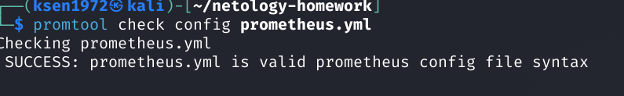
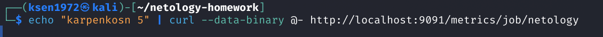
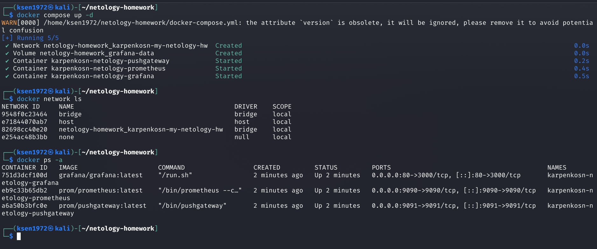
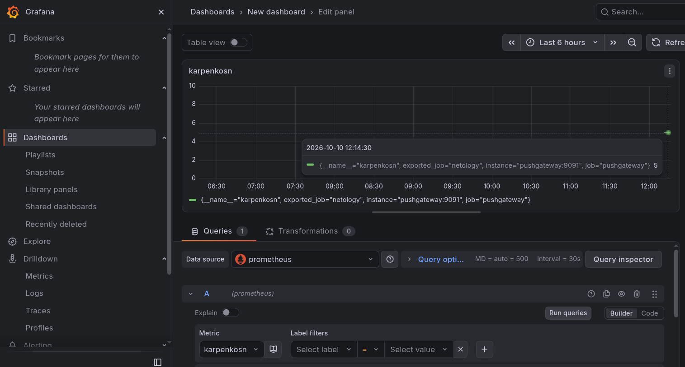
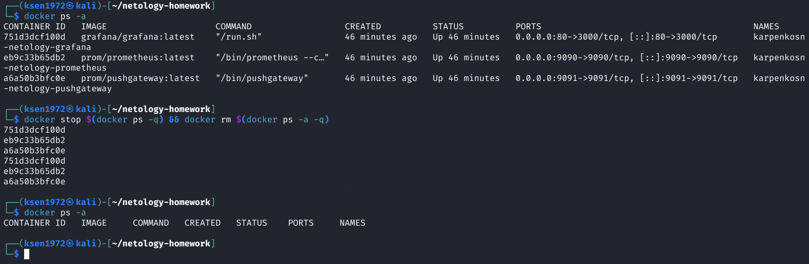

# Домашнее задание к занятию "Docker, часть 2" " - `Карпенко Сергей`


### Инструкция по выполнению домашнего задания

   1. Сделайте `fork` данного репозитория к себе в Github и переименуйте его по названию или номеру занятия, например, https://github.com/имя-вашего-репозитория/git-hw или  https://github.com/имя-вашего-репозитория/7-1-ansible-hw).
   2. Выполните клонирование данного репозитория к себе на ПК с помощью команды `git clone`.
   3. Выполните домашнее задание и заполните у себя локально этот файл README.md:
      - впишите вверху название занятия и вашу фамилию и имя
      - в каждом задании добавьте решение в требуемом виде (текст/код/скриншоты/ссылка)
      - для корректного добавления скриншотов воспользуйтесь [инструкцией "Как вставить скриншот в шаблон с решением](https://github.com/netology-code/sys-pattern-homework/blob/main/screen-instruction.md)
      - при оформлении используйте возможности языка разметки md (коротко об этом можно посмотреть в [инструкции  по MarkDown](https://github.com/netology-code/sys-pattern-homework/blob/main/md-instruction.md))
   4. После завершения работы над домашним заданием сделайте коммит (`git commit -m "comment"`) и отправьте его на Github (`git push origin`);
   5. В личном кабинете прикрепите и отправьте ссылку на решение в виде md-файла в вашем Github.
   6. Любые вопросы по выполнению заданий спрашивайте в разделе “Вопросы по заданию” в личном кабинете.
   
Желаем успехов в выполнении домашнего задания!
   
### Дополнительные материалы, которые могут быть полезны для выполнения задания

1. [Руководство по оформлению Markdown файлов](https://gist.github.com/Jekins/2bf2d0638163f1294637#Code)

---

### Задание 1

Напишите ответ в свободной форме, не больше одного абзаца текста.

Установите Docker Compose и опишите, для чего он нужен и как может улучшить лично вашу жизнь.

### Ответ на Задание 1
Docker Compose — это инструмент для управления многоконтейнерными приложениями. Он позволяет описать все сервисы  приложения (веб-сервер, базу данных, кэш и т.д.) в одном конфигурационном файле docker-compose.yml. 
Зачем он нужен:
Упрощает запуск сложных проектов. Вместо того чтобы вручную запускать каждый контейнер отдельно вы описываете всё в одном файле. 
Стандартизирует окружение. Все разработчики в команде работают с одинаковой средой, что исключает проблемы «работает у меня, но не у тебя». 
Автоматизирует настройку. Compose сам создаёт сеть, связывает контейнеры, настраивает тома и зависимости. 
Как это улучшает жизнь:
Экономит время. Не нужно помнить и писать длинные команды для каждого контейнера. 
Снижает количество ошибок. Меньше ручной настройки — меньше шансов ошибиться. 
Упрощает деплой. Легко развернуть приложение на сервере или в тестовой среде. 
Декларативный подход. Вы описываете, что хотите, а не как это сделать.


### Задание 2
Выполните действия и приложите текст конфига на этом этапе.

Создайте файл docker-compose.yml и внесите туда первичные настройки:

version;
services;
volumes;
networks.
При выполнении задания используйте подсеть 10.5.0.0/16. Ваша подсеть должна называться: <ваши фамилия и инициалы>-my-netology-hw. Все приложения из последующих заданий должны находиться в этой конфигурации.

### Ответ на Задание 2
```
version: '3.8'
# В актуальном Docker Compose поле version: в корне YAML-файла больше не нужно и считается устаревшим
services: 
volumes: 
networks:
  karpenkosn-my-netology-hw:
    driver: bridge
    ipam:
      config:
        - subnet: 10.5.0.0/16
```

### Задание 3

**Выполните действия:**

1. Создайте конфигурацию docker-compose для Prometheus с именем контейнера <ваши фамилия и инициалы>-netology-prometheus.
2. Добавьте необходимые тома с данными и конфигурацией (конфигурация лежит в репозитории в директории [6-04/prometheus](https://github.com/netology-code/sdvps-homeworks/tree/main/lecture_demos/6-04/prometheus) ).
3. Обеспечьте внешний доступ к порту 9090 c докер-сервера.

### Ответ на Задание 3

Создал конфигурацию docker-compose для Prometheus с именем контейнера karpenkosn-netology-prometheus.
Добавил тома для данных (prometheus-data) и конфигурации (prometheus.yml)
Обеспечил внешний доступ к порту 9090.

```
global:
  scrape_interval: 15s
scrape_configs:
  - job_name: 'prometheus'
    scrape_interval: 5s
    static_configs:
      - targets: ['localhost:9090']
  - job_name: 'pushgateway'
    scrape_interval: 5s
    static_configs:
      - targets: ['pushgateway:9091']


```



```
version: '3.8'

services:
  prometheus:
    image: prom/prometheus:latest
    container_name: karpenkosn-netology-prometheus
    ports:
      - "9090:9090"
    volumes:
      - prometheus-data:/prometheus
      - ./prometheus.yml:/etc/prometheus/prometheus.yml
    networks:
      - karpenkosn-my-netology-hw
volumes:
  prometheus-data:
networks:
  karpenkosn-my-netology-hw:
    driver: bridge
    ipam:
      config:
        - subnet: 10.5.0.0/16


```
### Задание 4
Выполните действия:

Создайте конфигурацию docker-compose для Pushgateway с именем контейнера <ваши фамилия и инициалы>-netology-pushgateway.
Обеспечьте внешний доступ к порту 9091 c докер-сервера.

### Ответ на Задание 4

```
version: '3.8'
services:
  prometheus:
    image: prom/prometheus:latest
    container_name: karpenkosn-netology-prometheus
    ports:
      - "9090:9090"
    volumes:
      - prometheus-data:/prometheus
      - ./prometheus.yml:/etc/prometheus/prometheus.yml
    networks:
      - karpenkosn-my-netology-hw
  pushgateway:
    image: prom/pushgateway:latest
    container_name: karpenkosn-netology-pushgateway
    ports:
      - "9091:9091"
    networks:
      - karpenkosn-my-netology-hw
volumes:
  prometheus-data:
networks:
  karpenkosn-my-netology-hw:
    driver: bridge
    ipam:
      config:
        - subnet: 10.5.0.0/16

```
### Задание 5
Выполните действия:

Создайте конфигурацию docker-compose для Grafana с именем контейнера <ваши фамилия и инициалы>-netology-grafana.
Добавьте необходимые тома с данными и конфигурацией (конфигурация лежит в репозитории в директории 6-04/grafana.
Добавьте переменную окружения с путем до файла с кастомными настройками (должен быть в томе), в самом файле пропишите логин=<ваши фамилия и инициалы> пароль=netology.
Обеспечьте внешний доступ к порту 3000 c порта 80 докер-сервера.

### Ответ на Задание 5
Создал конфигурацию docker-compose для Grafana с именем контейнера karpenkosn-netology-grafana. Добавлены тома для данных (grafana-data) и конфигурации (custom.ini), настроена переменная окружения для пути к конфигурации. В custom.ini указаны логин karpenkosn и пароль netology. Обеспечен внешний доступ к порту 3000 через порт 80.


```
[security]
admin_user = karpenkosn
admin_password = netology

```
```


version: '3.8'
services:
  prometheus:
    image: prom/prometheus:latest
    container_name: karpenkosn-netology-prometheus
    ports:
      - "9090:9090"
    volumes:
      - prometheus-data:/prometheus
      - ./prometheus.yml:/etc/prometheus/prometheus.yml
    networks:
      - karpenkosn-my-netology-hw
  pushgateway:
    image: prom/pushgateway:latest
    container_name: karpenkosn-netology-pushgateway
    ports:
      - "9091:9091"
    networks:
      - karpenkosn-my-netology-hw
  grafana:
    image: grafana/grafana:latest
    container_name: karpenkosn-netology-grafana
    ports:
      - "80:3000"
    volumes:
      - grafana-data:/var/lib/grafana
      - ./custom.ini:/etc/grafana/grafana.ini
    environment:
      - GF_PATHS_CONFIG=/etc/grafana/grafana.ini
    networks:
      - karpenkosn-my-netology-hw
volumes:
  prometheus-data:
  grafana-data:
networks:
  karpenkosn-my-netology-hw:
    driver: bridge
    ipam:
      config:
        - subnet: 10.5.0.0/16


```

### Задание 6

**Выполните действия.**

1. Настройте поочередность запуска контейнеров.
2. Настройте режимы перезапуска для контейнеров.
3. Настройте использование контейнерами одной сети.
5. Запустите сценарий в detached режиме.

### Ответ на задание 6

Настроил поочередность запуска контейнеров: Pushgateway → Prometheus → Grafana.
Добавил режимы перезапуска always для всех контейнеров.
restart: always. Это значит, что контейнер сервиса будет автоматически перезапускаться системой даже если он завершился с ошибкой.
depends_on: - pushgateway. Эта опция указывает, что сервис должен запускаться только после того, как успешно запустится контейнер pushgateway ,
ну и по аналогии используется опция depends_on:- prometheus

все контейнеры используют сеть karpenko-my-netology-hw.

Сценарий запущен в detached-режиме с помощью команды docker compose up -d


### Задание 7
Выполните действия.

Выполните запрос в Pushgateway для помещения метрики <ваши фамилия и инициалы> со значением 5 в Prometheus: echo "<ваши фамилия и инициалы> 5" | curl --data-binary @- http://localhost:9091/metrics/job/netology.
Залогиньтесь в Grafana с помощью логина и пароля из предыдущего задания.
Cоздайте Data Source Prometheus (Home -> Connections -> Data sources -> Add data source -> Prometheus -> указать "Prometheus server URL = http://prometheus:9090" -> Save & Test).
Создайте график на основе добавленной в пункте 5 метрики (Build a dashboard -> Add visualization -> Prometheus -> Select metric -> Metric explorer -> <ваши фамилия и инициалы -> Apply.
В качестве решения приложите:

docker-compose.yml целиком;
скриншот команды docker ps после запуске docker-compose.yml;
скриншот графика, построенного на основе вашей метрики.

### Ответ на задание 7

Сделал запрос




 В Grafana вошел с логином karpenkosn и паролем netology.
 
Создал Data Source Prometheus с URL http://prometheus:9090. Построен график на основе метрики karpenkosn

```
version: '3.8'
services:
  pushgateway:
    image: prom/pushgateway:latest
    container_name: karpenkosn-netology-pushgateway
    ports:
      - "9091:9091"
    restart: always
    networks:
      - karpenkosn-my-netology-hw
  prometheus:
    image: prom/prometheus:latest
    container_name: karpenkosn-netology-prometheus
    ports:
      - "9090:9090"
    volumes:
      - prometheus-data:/prometheus
      - ./prometheus.yml:/etc/prometheus/prometheus.yml
    restart: always
    depends_on:
      - pushgateway
    networks:
      - karpenkosn-my-netology-hw
  grafana:
    image: grafana/grafana:latest
    container_name: karpenkosn-netology-grafana
    ports:
      - "80:3000"
    volumes:
      - grafana-data:/var/lib/grafana
      - ./custom.ini:/etc/grafana/grafana.ini
    environment:
      - GF_PATHS_CONFIG=/etc/grafana/grafana.ini
    restart: always
    depends_on:
      - prometheus
    networks:
      - karpenkosn-my-netology-hw
volumes:
  prometheus-data:
  grafana-data:
networks:
  karpenkosn-my-netology-hw:
    driver: bridge
    ipam:
      config:
        - subnet: 10.5.0.0/16
```




### Задание 8
Выполните действия:

Остановите и удалите все контейнеры одной командой.
В качестве решения приложите скриншот консоли с проделанными действиями.
### Ответ на Задание 8
```
docker stop $(docker ps -q) && docker rm $(docker ps -a -q)
```



